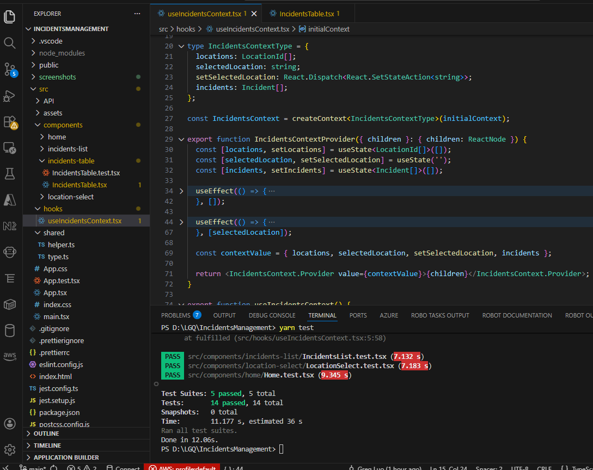
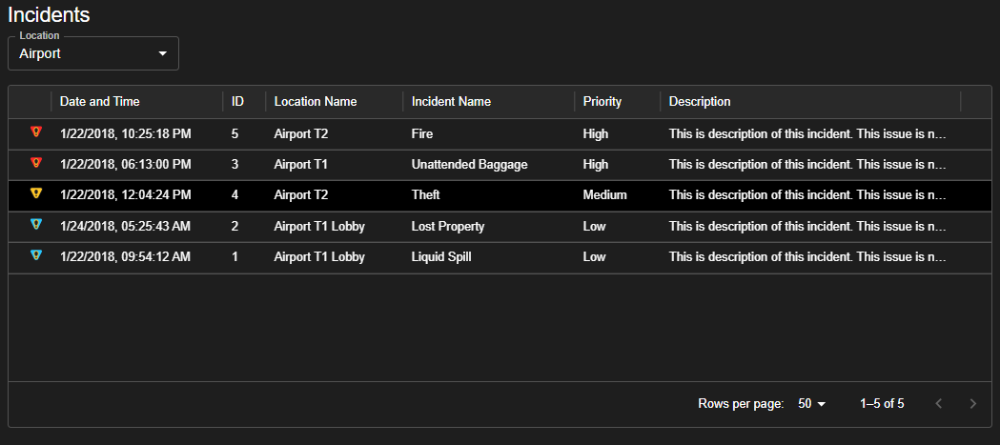
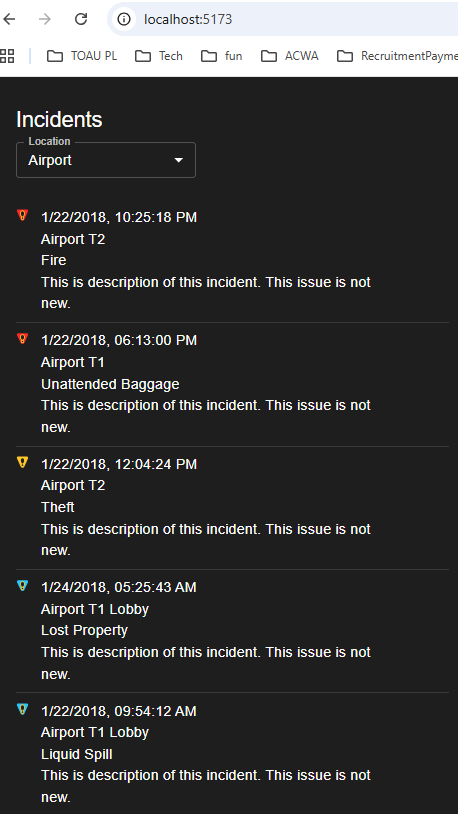

# Incidents Management by GREG LUO

greg.luo@outlook.com, 0424376962

This challenge takes me 3 hours

## Code Repo

Github repo: https://github.com/GregLuoDev/IncidentsManagement

---

## Technical choices

- React 19, Tailwindcss, MUI
- unit tests cover all components

## Steps to run it locally

- "yarn" to install dependencies
- "yarn dev" to run the app and then access it at browser with address "http://localhost:5173/"
- "yarn build" to build for production
- "yarn test" to run test cases

## Code structure

## UI

